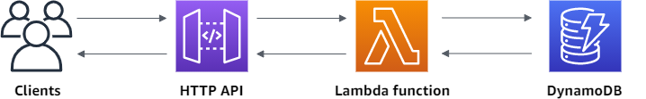
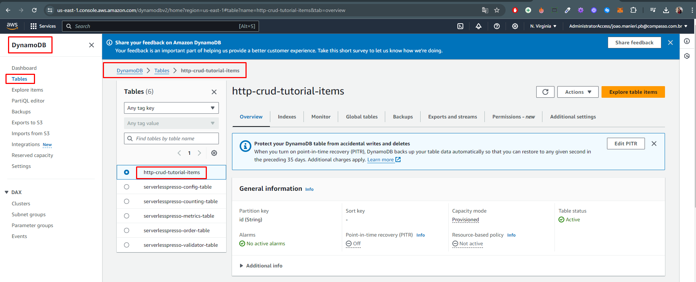
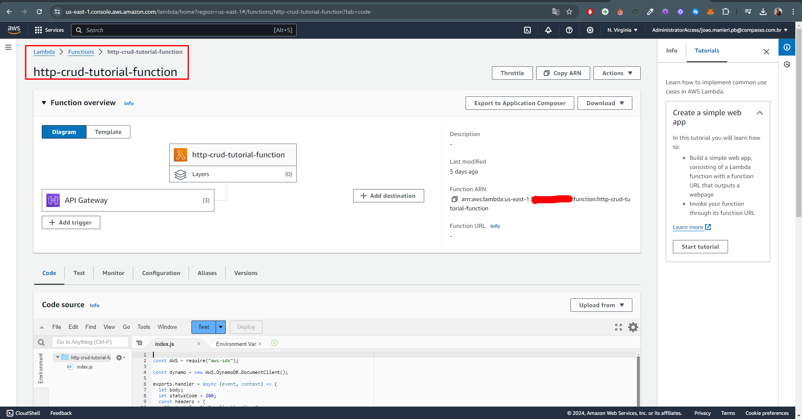
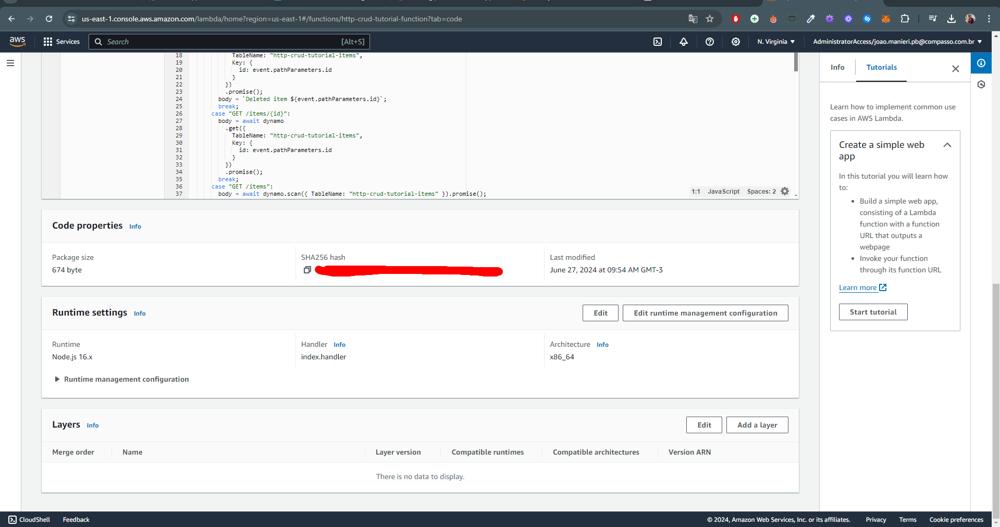
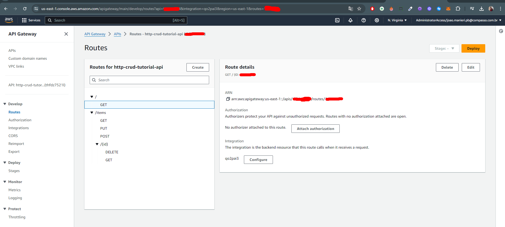
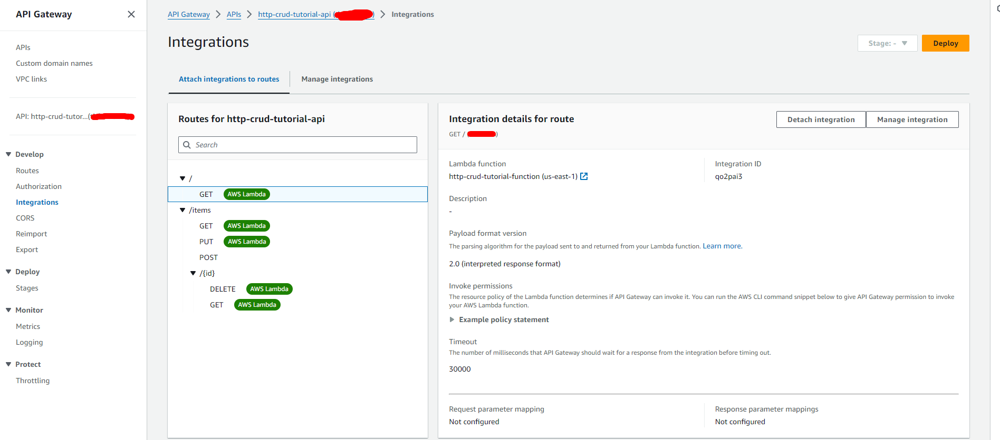
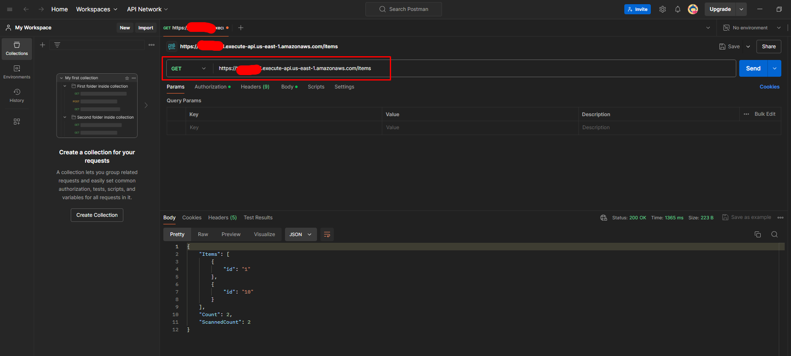
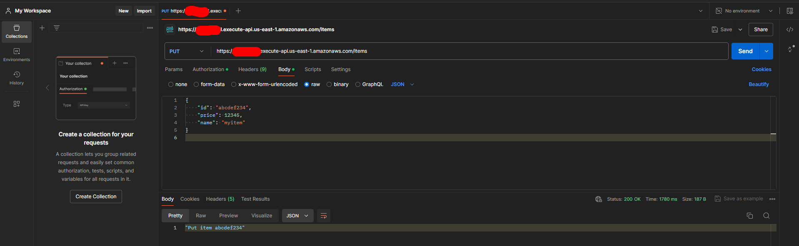
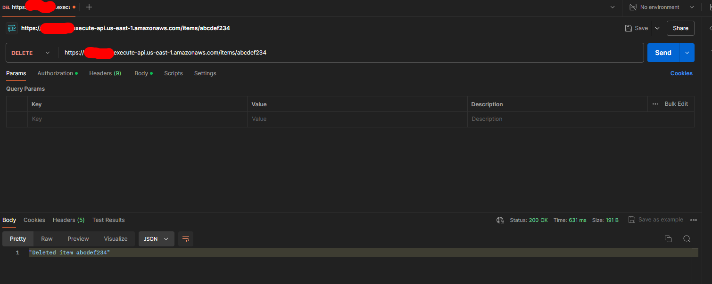

# 🚀 Relatório de Progresso: Criação da Sua Primeira API CRUD em 45 Minutos ou Menos!

## Objetivo
🎯 Nosso objetivo neste workshop é construir uma API CRUD (Create, Read, Update, Delete) muito simples. Vamos guiá-lo por todas as etapas, desde a criação de uma tabela DynamoDB até o teste da API.




---

## 1️⃣ Criar uma Tabela DynamoDB

Para criar uma tabela DynamoDB:
1. Abra o console do DynamoDB em: [DynamoDB Console](https://console.aws.amazon.com/dynamodb/)
2. Escolha **Create table**
3. Para **Table name**, insira `http-crud-tutorial-items`
4. Para **Primary key**, insira `id`
5. Escolha **Create**

🖼️ **Imagem:**


---

## 2️⃣ Crie uma Função Lambda

Para criar uma função Lambda:
1. Acesse o console Lambda em: [Lambda Console](https://console.aws.amazon.com/lambda)
2. Escolha **Create function**
3. Selecione **Author from scratch**
4. Para **Function name**, insira `http-crud-tutorial-function`
5. Em **Runtime**, selecione **Node.js 14.x**
6. Em **Permissions**, escolha **Change default execution role**
7. Selecione **Create a new role from AWS policy templates**
8. Para **Role name**, insira `http-crud-tutorial-role`
9. Para **Policy templates**, escolha **Simple microservice permissions**
10. Escolha **Create function**

Role para baixo até o editor **Code source** no console.
Abra o arquivo `index.js` e substitua seu conteúdo pelo seguinte código:

```javascript
const AWS = require("aws-sdk");

const dynamo = new AWS.DynamoDB.DocumentClient();

exports.handler = async (event, context) => {
  let body;
  let statusCode = 200;
  const headers = {
    "Content-Type": "application/json"
  };

  try {
    switch (event.routeKey) {
      case "DELETE /items/{id}":
        await dynamo
          .delete({
            TableName: "http-crud-tutorial-items",
            Key: {
              id: event.pathParameters.id
            }
          })
          .promise();
        body = `Deleted item ${event.pathParameters.id}`;
        break;
      case "GET /items/{id}":
        body = await dynamo
          .get({
            TableName: "http-crud-tutorial-items",
            Key: {
              id: event.pathParameters.id
            }
          })
          .promise();
        break;
      case "GET /items":
        body = await dynamo.scan({ TableName: "http-crud-tutorial-items" }).promise();
        break;
      case "PUT /items":
        let requestJSON = JSON.parse(event.body);
        await dynamo
          .put({
            TableName: "http-crud-tutorial-items",
            Item: {
              id: requestJSON.id,
              price: requestJSON.price,
              name: requestJSON.name
            }
          })
          .promise();
        body = `Put item ${requestJSON.id}`;
        break;
      default:
        throw new Error(`Unsupported route: "${event.routeKey}"`);
    }
  } catch (err) {
    statusCode = 400;
    body = err.message;
  } finally {
    body = JSON.stringify(body);
  }

  return {
    statusCode,
    body,
    headers
  };
};
```

Escolha **Deploy** para atualizar sua função.

🖼️ **Imagens:**



---

## 3️⃣ Criar uma API HTTP

Para criar uma API HTTP:
1. Entre no console do API Gateway em: [API Gateway Console](https://console.aws.amazon.com/apigateway)
2. Selecione **Create API** (se você vir uma tela de boas-vindas, pule esta etapa e vá para a etapa 3)
3. Para **HTTP API**, escolha **Build API HTTP**
4. Para o nome da API, digite `http-crud-tutorial-api`
5. Para **Configurar rotas**, escolha **Próximo** para pular a criação de rotas. Você criará rotas mais tarde.
6. Revise o estágio que o API Gateway cria para você (`$default`) e escolha **Avançar**
7. Selecione **Create**

🖼️ **Imagem:**


---

## 4️⃣ Criar Rotas

Para criar rotas:
1. Acesse o console do API Gateway em: [API Gateway Console](https://console.aws.amazon.com/apigateway)
2. Escolha sua API (`http-crud-tutorial-api`)
3. No painel à esquerda, escolha **Routes**
4. Escolha **Create**
5. Para **Method**, escolha **GET**
6. Para o caminho, insira `/items/{id}`. O `{id}` no final do caminho é um parâmetro de caminho que o API Gateway recupera do caminho da solicitação quando um cliente faz uma solicitação.
7. Escolha **Create**

Repita os passos 4-7 para **GET /items**, **DELETE /items/{id}** e **PUT /items**.
Confirme que todas as rotas foram criadas.

🖼️ **Imagem:**


---

## 5️⃣ Criar uma Integração

Para criar uma integração:
1. Acesse o console do API Gateway em: [API Gateway Console](https://console.aws.amazon.com/apigateway)
2. Escolha sua API (`http-crud-tutorial-api`)
3. Escolha **Integrations**
4. Escolha **Manage integrations** e então escolha **Create**
5. Pule **Attach this integration to a route**. Você completará isso em uma etapa posterior.
6. Para **Integration type**, escolha **Lambda function**
7. Para **Lambda function**, insira `http-crud-tutorial-function`
8. Escolha **Create**

🖼️ **Imagem:**


---

## 6️⃣ Anexar sua Integração às Rotas

Para anexar a integração às rotas:
1. Acesse o console do API Gateway em: [API Gateway Console](https://console.aws.amazon.com/apigateway)
2. Escolha sua API (`http-crud-tutorial-api`)
3. Escolha **Integrations**
4. Escolha uma rota
5. Sob **Choose an existing integration**, escolha `http-crud-tutorial-function`
6. Escolha **Attach integration**

Repita os passos 4-6 para todas as rotas. Todas as rotas devem mostrar que uma integração AWS Lambda está anexada.

🖼️ **Imagem:**


---

## 7️⃣ Teste sua API

Agora é hora de testar sua API para garantir que tudo está funcionando corretamente! 🎉

🖼️ **Imagens:**




---

## Limpar! (Evitar Gastos) 💸

Lembre-se de limpar seus recursos após completar o tutorial para evitar custos indesejados.

### Para deletar uma tabela DynamoDB:
1. Abra o console do DynamoDB em: [DynamoDB Console](https://console.aws.amazon.com/dynamodb/)
2. Selecione sua tabela.
3. Escolha **Delete table**.
4. Confirme sua escolha e escolha **Delete**.

### Para deletar uma API HTTP:
1. Acesse o console do API Gateway em: [API Gateway Console](https://console.aws.amazon.com/apigateway)
2. Na página **APIs**, selecione uma API.
3. Escolha **Actions**, e então escolha **Delete**.
4. Escolha **Delete**.

### Para deletar uma função Lambda:
1. Acesse o console Lambda em: [Lambda Console](https://console.aws.amazon.com/lambda)
2. Na página **Functions**, selecione uma função.
3. Escolha **Actions**, e então escolha **Delete**.
4. Escolha **Delete**.

### Para deletar o grupo de logs de uma função Lambda:
1. No console do Amazon CloudWatch, abra a página **Log groups**
2. Na página **Log groups**, selecione o grupo de logs da função (`/aws/lambda/http-crud-tutorial-function`).
3. Escolha **Actions**, e então escolha **Delete log group**.
4. Escolha **Delete**.

### Para deletar a role de execução de uma função Lambda:
1. No console do AWS Identity and Access Management, abra a página **Roles**
2. Selecione a role da função, por exemplo, `http-crud-tutorial-role`.
3. Escolha **Delete role**.
4. Escolha **Yes, delete**.

### Para deletar o IDE do Cloud9:
1. Acesse o console do Cloud9 em: [Cloud9 Console](https://console.aws.amazon.com/cloud9/)
2. Na página **Your environments**, selecione um IDE.
3. Escolha