# Progress Report: AWS Course - Serverlesspresso ☕️

## Introdução
Serverlesspresso é uma cafeteria pop-up que oferece bebidas de espresso premium em conferências e eventos. Os organizadores trouxeram uma equipe de elite dos melhores baristas do mundo para preparar 1.000 bebidas por dia para os clientes.

### Como funciona o bar de café? ☕️
O processo de pedido do bar de café é o seguinte:

- Os monitores suspensos exibem um código QR que muda a cada 5 minutos. Os clientes escaneiam este código QR para fazer um pedido usando seu dispositivo móvel. O código QR é válido para 10 bebidas no período de 5 minutos e desaparece da tela assim que não houver mais bebidas disponíveis. Isso ajuda a evitar que os baristas fiquem sobrecarregados com pedidos!
- O cliente faz o pedido no aplicativo web carregado pelo código QR. O backend valida o pedido, cria um número de pedido e o disponibiliza para os baristas.
- Os baristas veem o pedido aparecer em seu próprio aplicativo. Eles podem alterar o status do pedido para indicar quando está sendo preparado, quando está concluído ou se precisam cancelar o pedido.
- O cliente vê todas as atualizações do barista em seu dispositivo móvel. Os monitores suspensos também mostram o status das bebidas próximas e concluídas.

### Estrutura da aplicação 🏗️
Você estará criando vários microserviços que integram frontends existentes com sua aplicação serverless backend. Você usará AWS Step Functions para lidar com orquestração e Amazon EventBridge para lidar com coreografia.
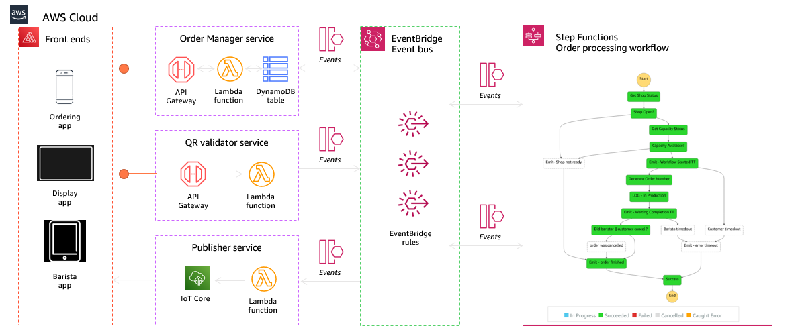


---

### 1a. Construindo o workflow - Parte 1 🛠️
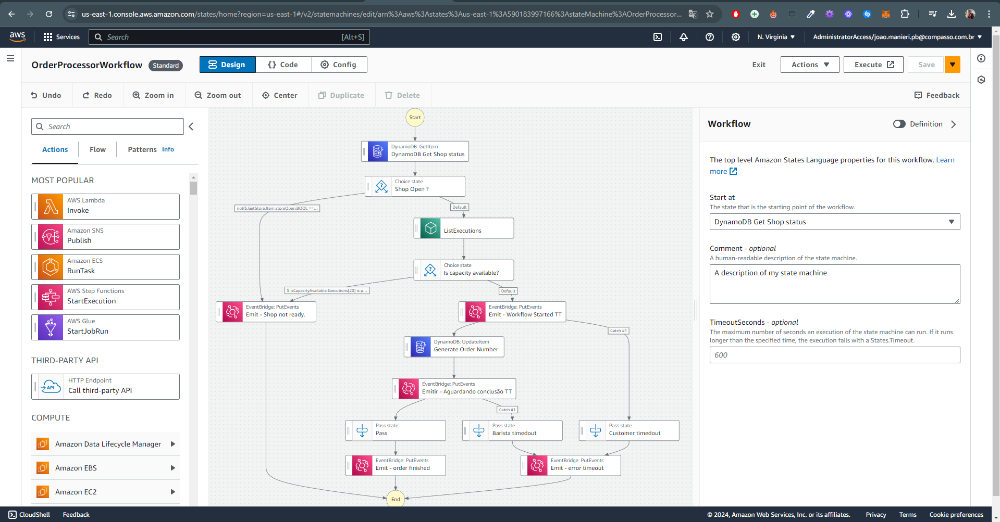
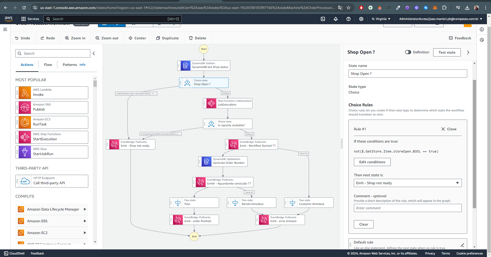
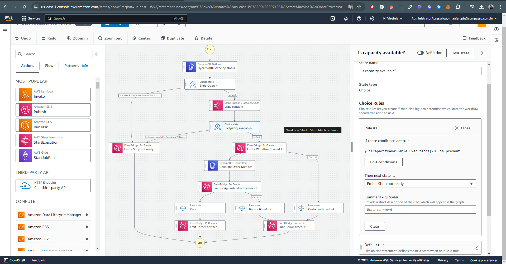

### 1b. Construindo o workflow - Parte 2 🛠️
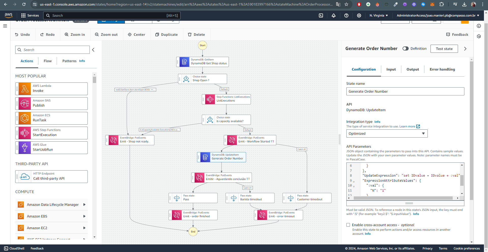
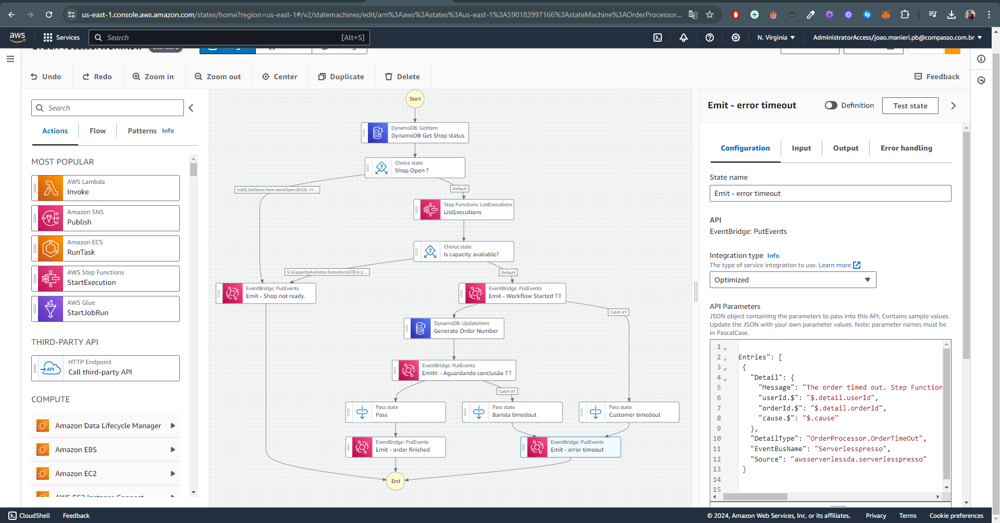
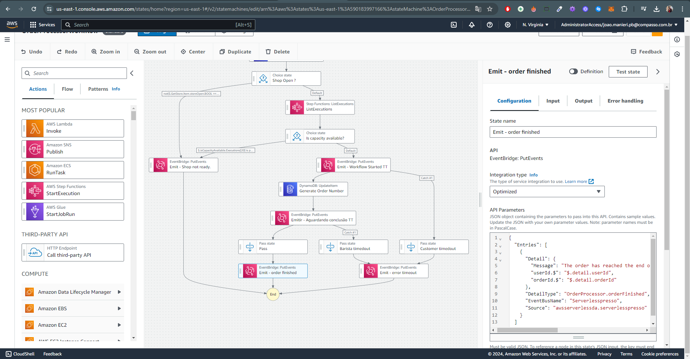
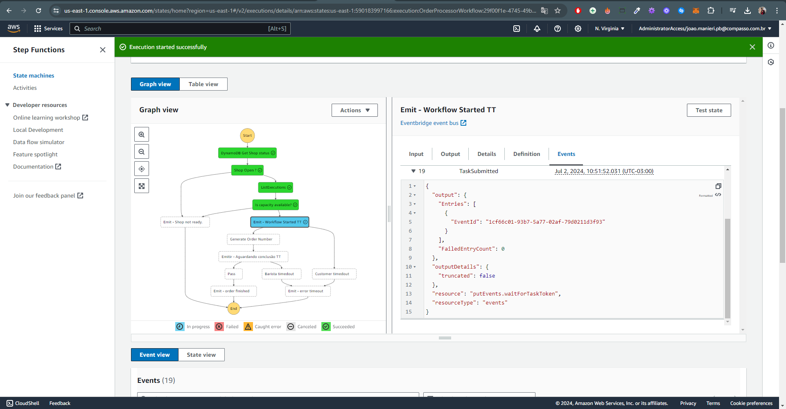
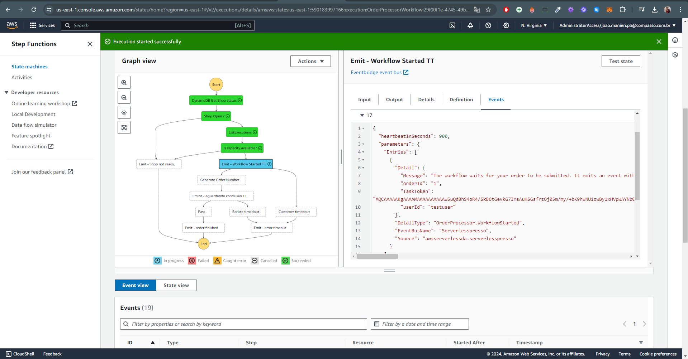

#### Workflow completo 
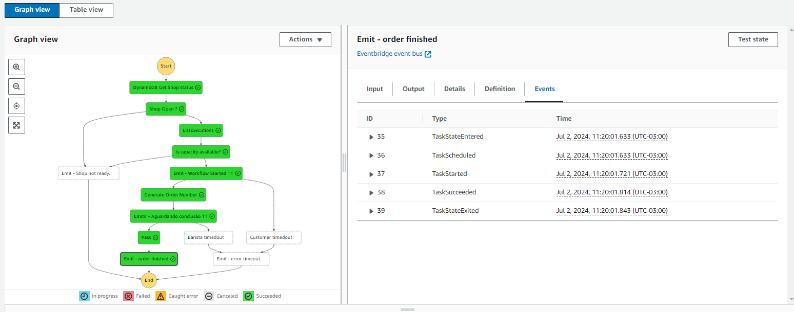


#### DynamoDB
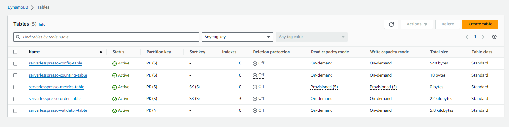

---

### 2. Roteamento de eventos 🔄
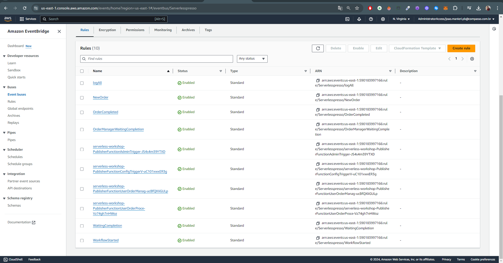
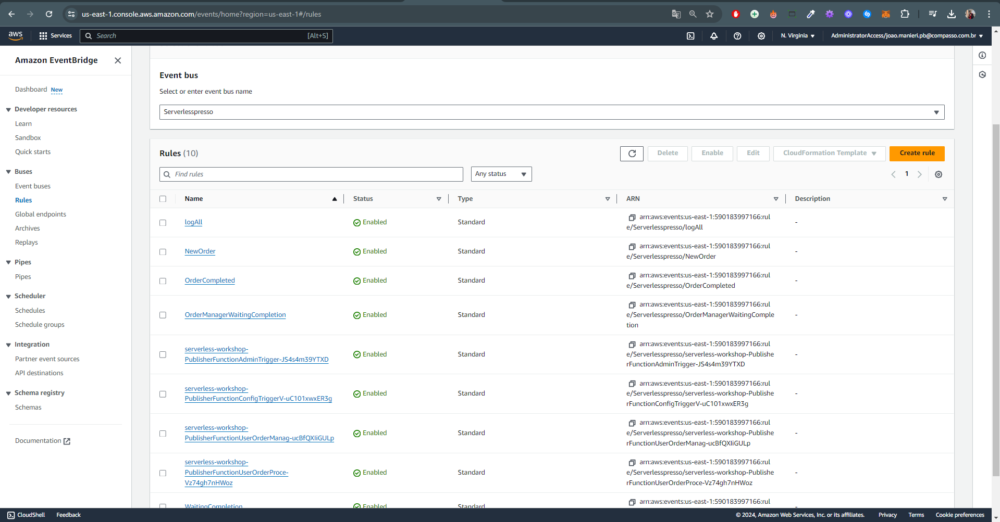


---

### 3. Configurando os frontends 💻


**Display App:**
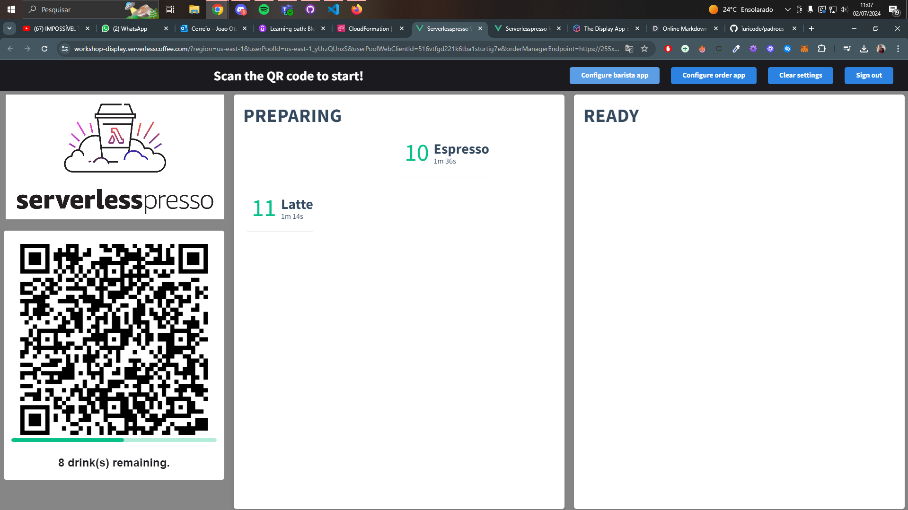

**Barista App:**
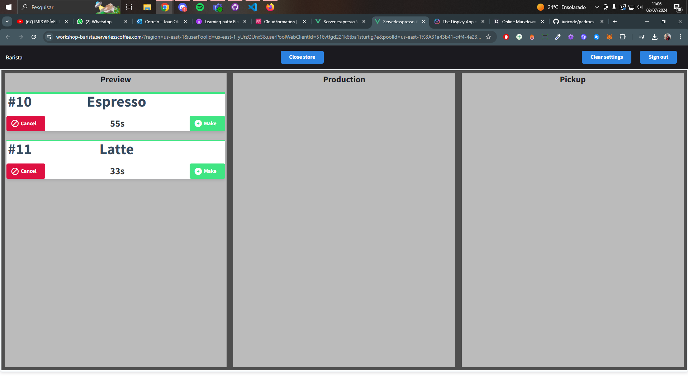


**Cliente App:**
.jpeg)
.jpeg)
.jpeg)

---

### 4. Avançado 🚀
**A. Métricas de negócios com SQS e DynamoDB**
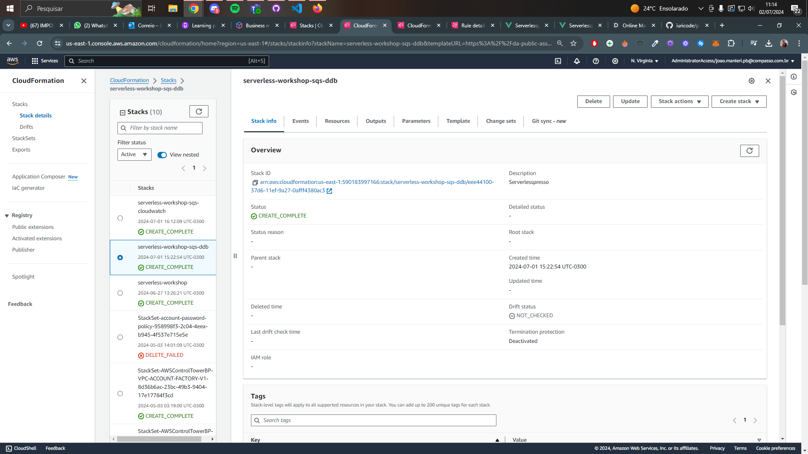

**B. Métricas de negócios com SQS e Cloudwatch**
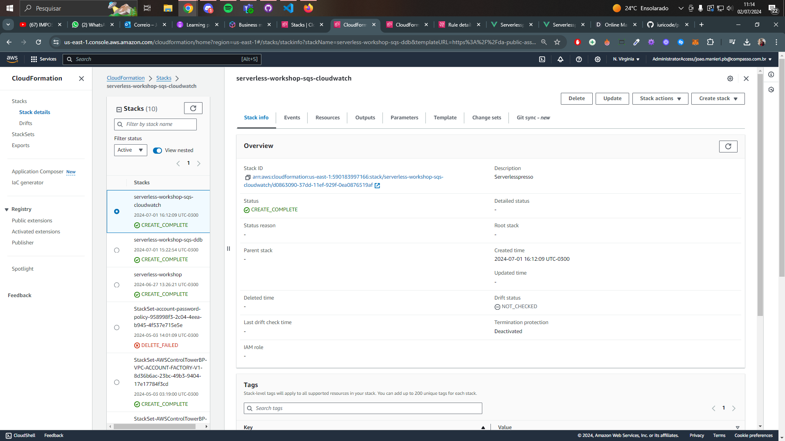

---

### Cleanup 🧹

#### 1. Buckets do S3
Para listar os buckets usados neste workshop a partir do Cloud9:
```
aws s3 ls | grep serverlesspresso
```
Para deletar cada bucket e seu conteúdo, substitua `your-bucket-name` pelo nome de cada bucket:
```
aws s3 rb --force s3://your-bucket-name
```

#### 2. Recursos no CloudFormation
Para listar os stacks usados neste workshop a partir do Cloud9:
```
aws cloudformation list-stacks | grep serverlesspresso
```
Para deletar cada stack começando com `serverlesspresso`, substitua `your-stack-name` pelo nome de cada stack:
```
aws cloudformation delete-stack --stack-name your-stack-name
```

#### 3. Regras do EventBridge
Para listar as regras do EventBridge usadas neste workshop a partir do Cloud9:
```
aws events list-rules --event-bus-name Serverlesspresso
```
Para deletar cada regra, substitua `your-rule-name` pelo nome da regra:
```
aws events delete-rule --name 'your-rule-name'
```