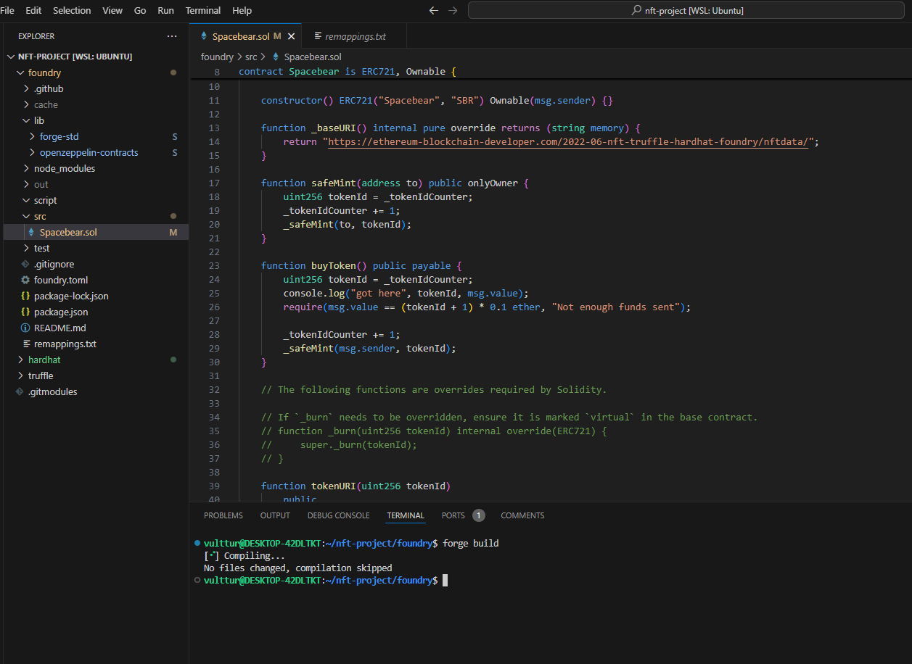
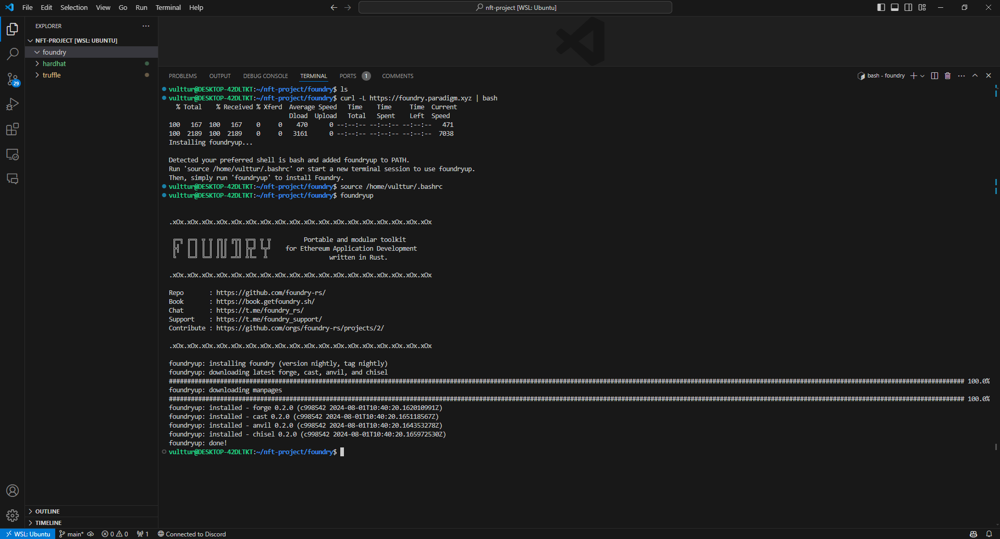
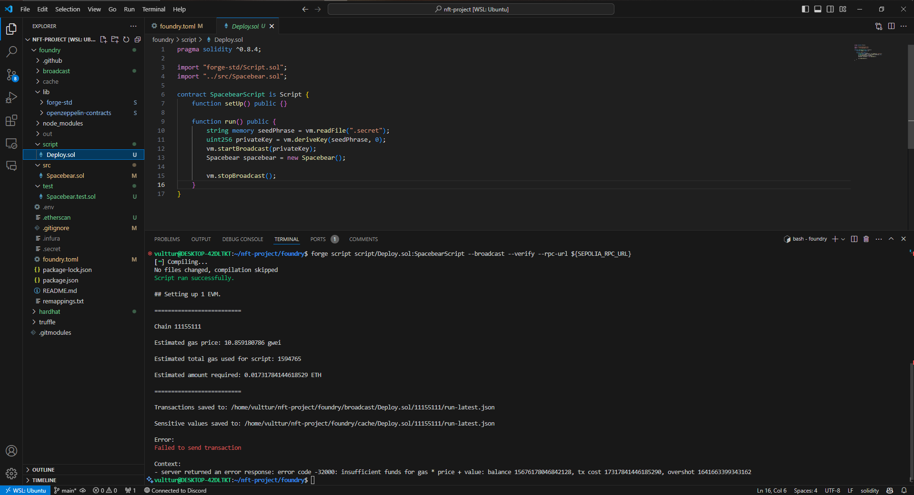
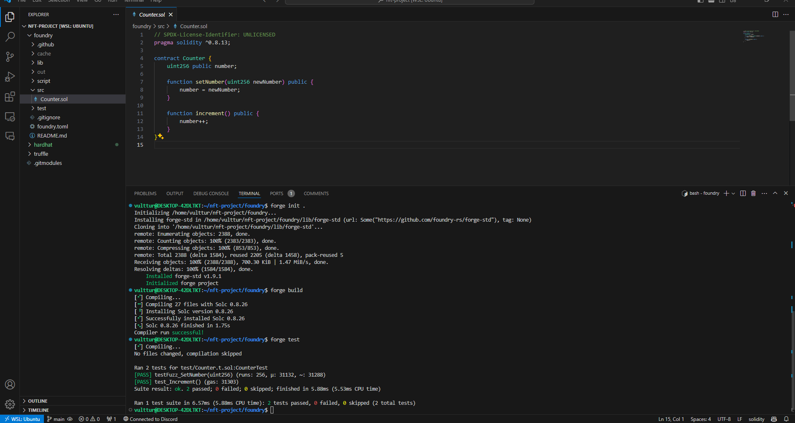
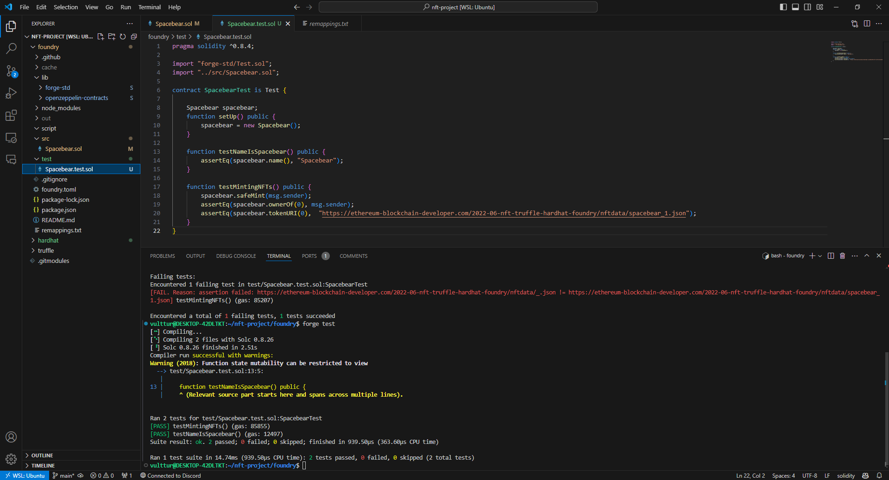

## Foundry

**Foundry is a blazing fast, portable and modular toolkit for Ethereum application development written in Rust.**

Foundry consists of:

-   **Forge**: Ethereum testing framework (like Truffle, Hardhat and DappTools).
-   **Cast**: Swiss army knife for interacting with EVM smart contracts, sending transactions and getting chain data.
-   **Anvil**: Local Ethereum node, akin to Ganache, Hardhat Network.
-   **Chisel**: Fast, utilitarian, and verbose solidity REPL.

## Documentation

https://book.getfoundry.sh/

## Usage

### Build

```shell
$ forge build
```

### Test

```shell
$ forge test
```

### Format

```shell
$ forge fmt
```

### Gas Snapshots

```shell
$ forge snapshot
```

### Anvil

```shell
$ anvil
```

### Deploy

```shell
$ forge script script/Counter.s.sol:CounterScript --rpc-url <your_rpc_url> --private-key <your_private_key>
```

### Cast

```shell
$ cast <subcommand>
```

### Help

```shell
$ forge --help
$ anvil --help
$ cast --help
```

# 🚀 Guia para Configurar e Rodar a NFT "Spacebear" com Foundry

## 1. Instalação e Configuração do Foundry 🛠️

### 1.1. Instalar o Foundry
Para instalar o Foundry, execute um script de shell diretamente no seu computador.

1. Crie uma nova pasta para o Foundry dentro do seu projeto `nft-project`:
   ```bash
   mkdir foundry
   cd foundry
   ```

2. Baixe e execute o script de instalação do Foundry:
   ```bash
   curl -L https://foundry.paradigm.xyz | bash
   source ~/.bashrc
   foundryup
   ```

### 1.2. Ferramentas do Foundry
Após a instalação, você terá acesso às seguintes ferramentas:
- `forge`: Para construir, testar, depurar e fazer deploy de contratos inteligentes.
- `anvil`: Equivalente ao Ganache no Foundry, um nó local para testes.
- `cast`: Acesso de baixo nível a contratos inteligentes, semelhante ao console do Truffle.

## 2. Inicializando um Novo Projeto no Foundry 📂

1. Para começar, inicialize um novo projeto dentro da pasta `foundry`:
   ```bash
   forge init .
   ```

## 3. Construção e Testes usando Forge 🛠️

### 3.1. Construindo os Contratos
Para construir os contratos inteligentes, simplesmente execute:
   ```bash
   forge build
   ```

### 3.2. Limpeza de Arquivos Padrão
Vamos remover os contratos, testes e scripts padrão:
   ```bash
   rm src/*.sol test/*.sol script/*.sol
   ```

### 3.3. Instalação do OpenZeppelin Contracts
Instale os contratos do OpenZeppelin:
   ```bash
   forge install openzeppelin/openzeppelin-contracts
   ```

Se ocorrer um erro devido a mudanças no Git, siga os passos abaixo:

1. Verifique as alterações:
   ```bash
   git status
   ```

2. Adicione e comite as mudanças:
   ```bash
   git add .
   git commit -a -m "Adicionado contrato Spacebear e removido arquivos padrão"
   ```

3. Tente novamente a instalação:
   ```bash
   forge install openzeppelin/openzeppelin-contracts
   ```

Agora a compilação deve funcionar corretamente.

## 4. Adicionando Testes no Foundry 🧪

### 4.1. Executando Testes
Para executar os testes, use:
   ```bash
   forge test
   ```

## 5. Deploy de Contratos Inteligentes com Foundry 🚀

### 5.1. Criando um Script de Deploy
Vamos criar um script chamado "Deploy.sol" na pasta `script`:

```solidity
pragma solidity ^0.8.4;

import "forge-std/Script.sol";
import "../src/Spacebear.sol";

contract SpacebearScript is Script {
    function setUp() public {}

    function run() public {
        string memory seedPhrase = vm.readFile(".secret");
        uint256 privateKey = vm.deriveKey(seedPhrase, 0);
        vm.startBroadcast(privateKey);
        Spacebear spacebear = new Spacebear();
        vm.stopBroadcast();
    }
}
```

### 5.2. Executando o Script de Deploy
Para executar o script e fazer o deploy do contrato, use o seguinte comando:
   ```bash
   forge script script/Deploy.sol:SpacebearScript --broadcast --verify --rpc-url ${SEPOLIA_RPC_URL}
   ```

---






