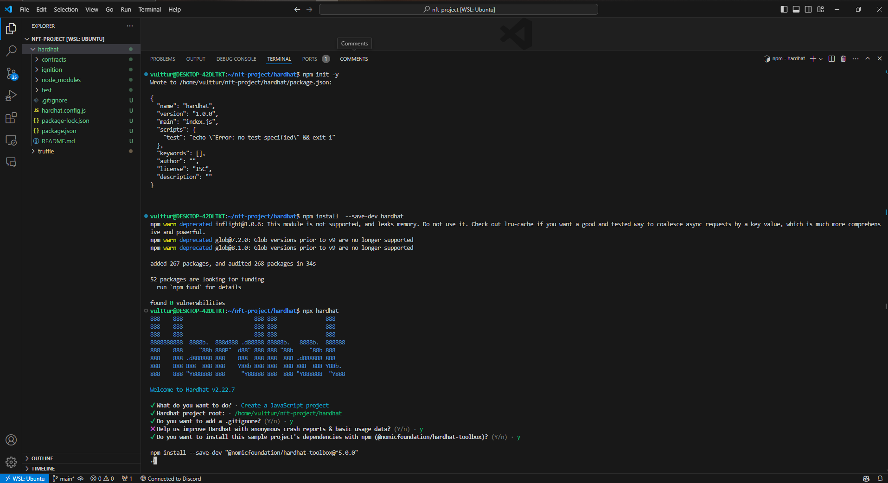
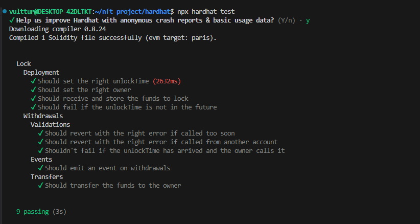
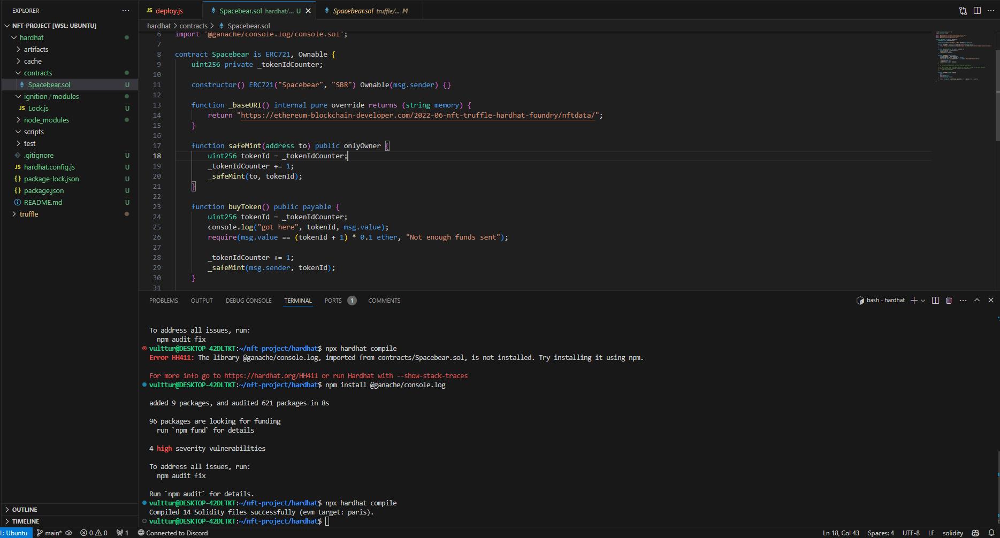
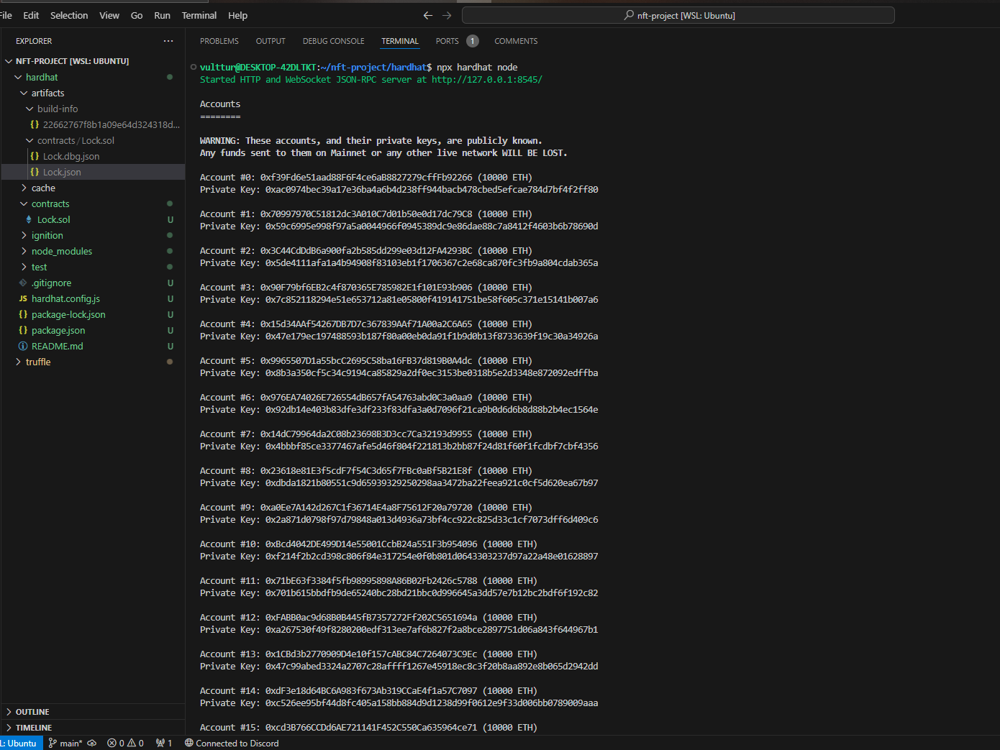
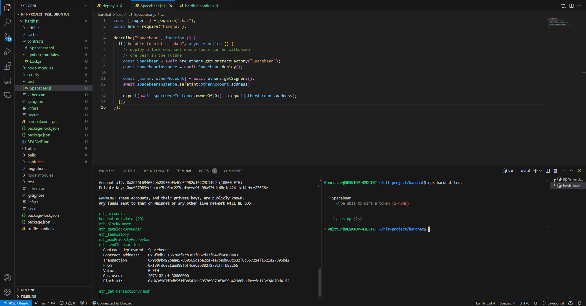

# 🚀 Guia para Configurar e Rodar a NFT "Spacebear" com Hardhat

## 1. Configuração Inicial do Hardhat 🛠️

### 1.1. Instalar o Hardhat
O Hardhat é baseado em JavaScript (node), assim como o Truffle. A diferença é que ele é instalado como uma dependência de desenvolvimento específica para o projeto.

1. Crie uma nova pasta no seu projeto `nft-project` chamada `hardhat`:
   ```bash
   mkdir -p nft-project/hardhat
   code nft-project/hardhat
   ```

2. Inicialize um projeto npm vazio:
   ```bash
   npm init -y
   ```

3. Instale o Hardhat como uma dependência de desenvolvimento:
   ```bash
   npm install --save-dev hardhat
   ```


### 1.2. Configurar o Hardhat
1. Agora que o Hardhat está instalado, configure um novo projeto Hardhat:
   ```bash
   npx hardhat
   ```

2. Para testar a configuração, execute:
   ```bash
   npx hardhat test
   ```

   

## 2. Compilação e ABI Array 📦
Assim como no Truffle, você pode compilar os contratos com o Hardhat utilizando o comando:
   ```bash
   npx hardhat compile
   ```



## 3. Adicionando a NFT no Hardhat 🐻

### 3.1. Remover Contratos Padrão
Vamos remover os contratos padrão e arquivos que não são necessários:
   ```bash
   rm contracts/Lock.sol
   rm scripts/deploy.js
   rm test/Lock.js
   rm -rf artifacts
   rm -rf cache
   ```

### 3.2. Instalar OpenZeppelin Contracts
Agora, vamos instalar os contratos do OpenZeppelin:
   ```bash
   npm install @openzeppelin/contracts
   ```

### 3.3. Compilar o Projeto
Compile novamente o projeto:
   ```bash
   npx hardhat compile
   ```

## 4. Deploy de Contratos Inteligentes com Hardhat 🚀

### 4.1. Deploy Local (Hardhat Node)
1. Inicie um nó local do Hardhat em um terminal:
   ```bash
   npx hardhat node
   ```


2. Em outro terminal, execute o script de deploy na rede local:
   ```bash
   npx hardhat run --network localhost scripts/deploy.js
   ```

### 4.2. Deploy na Rede sepolia
Depois de testar localmente, você pode fazer o deploy para a rede sepolia:

1. Execute o comando:
   ```bash
   npx hardhat run --network sepolia scripts/deploy.js
   ```


---

