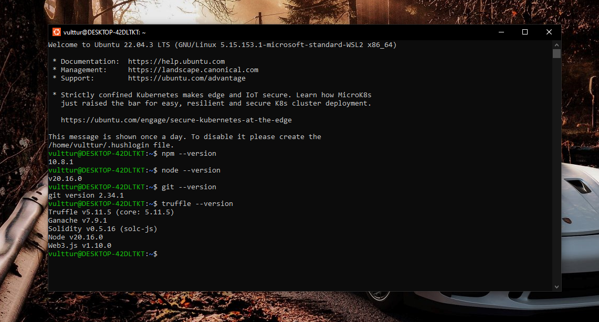
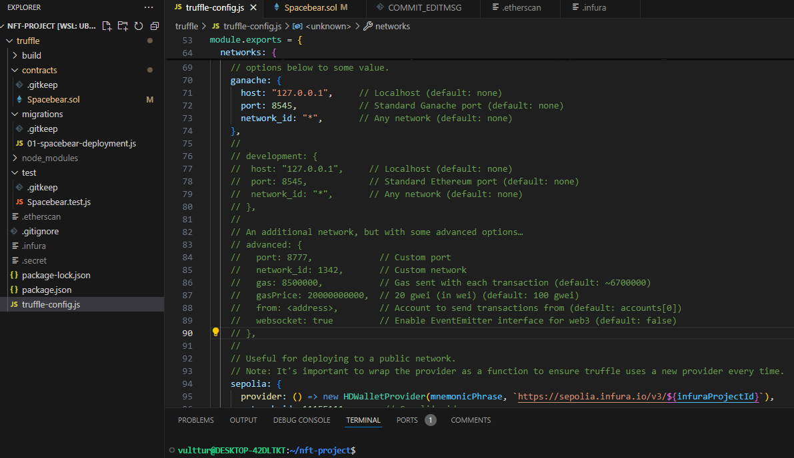
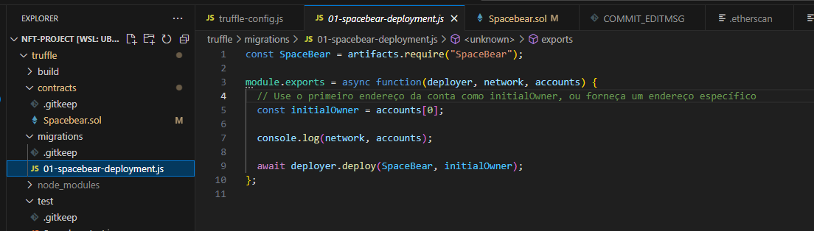
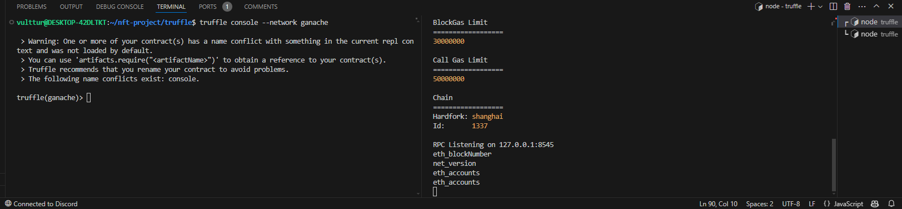
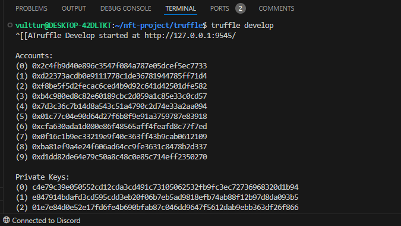
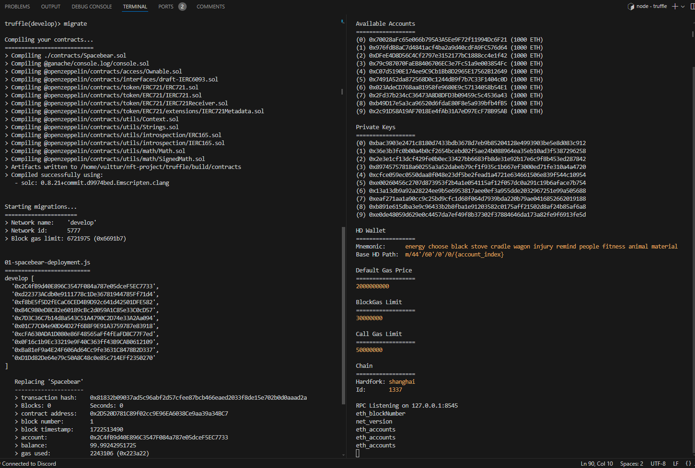
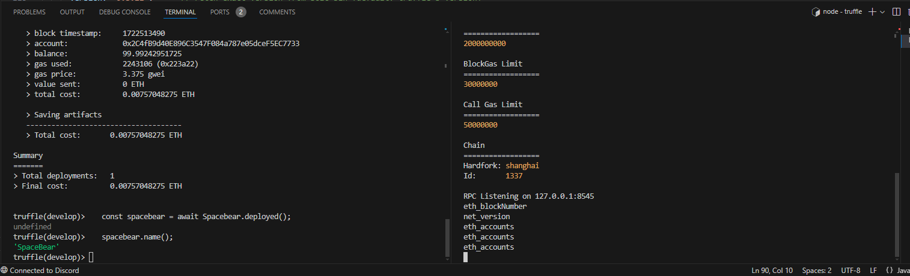
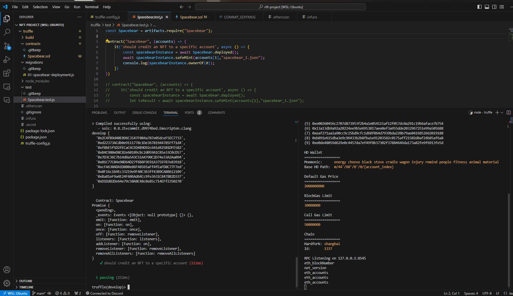
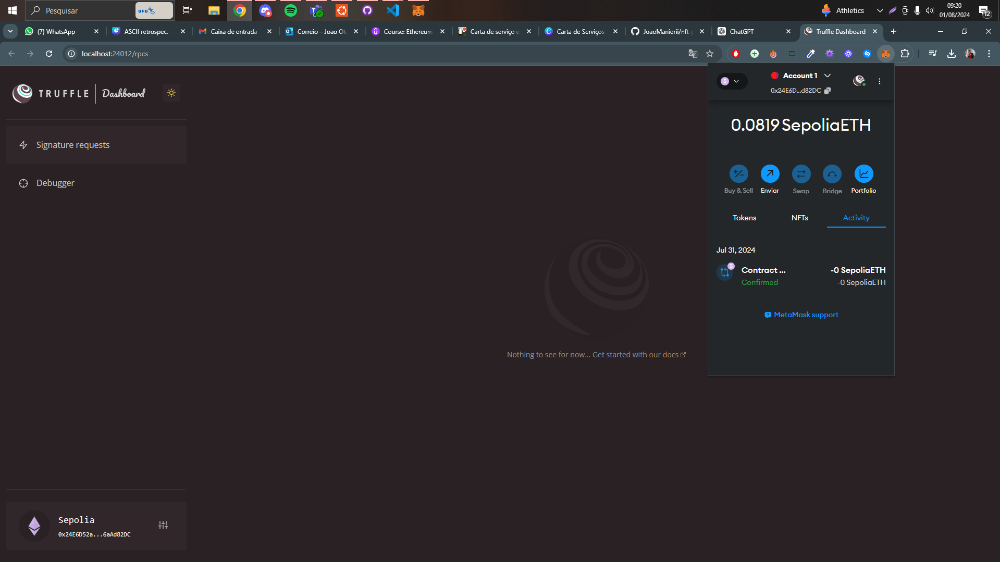
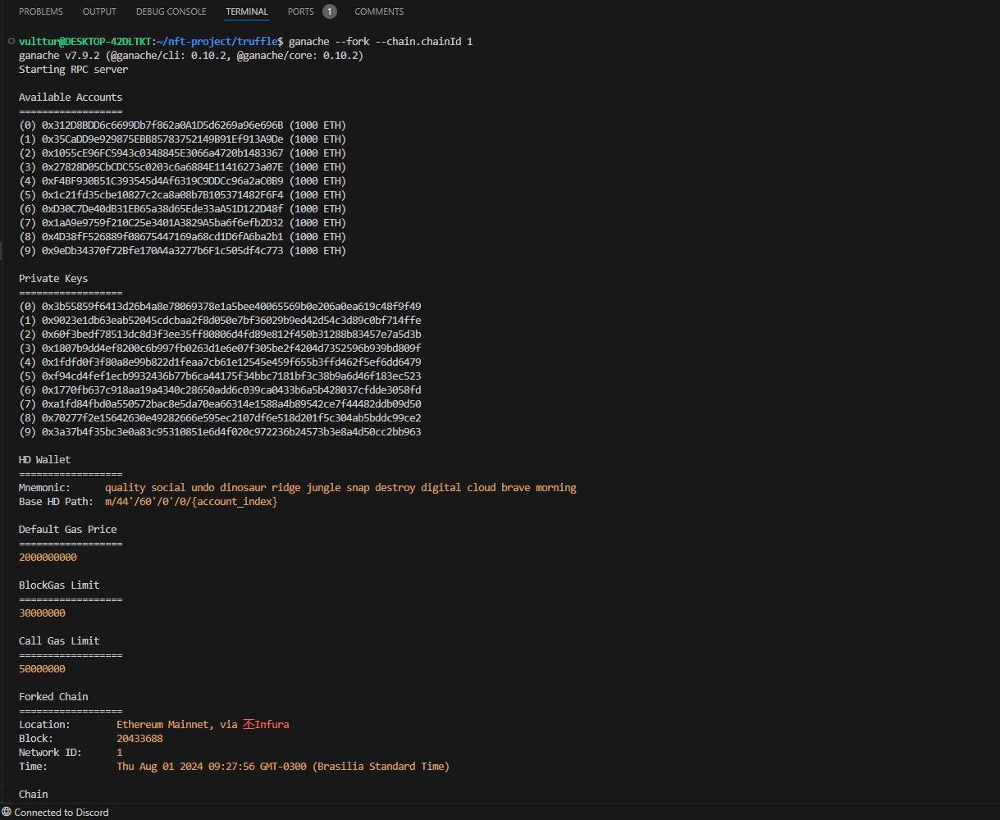

# 🚀 Guia para Rodar a NFT "Spacebear" com Truffle e VS Code no Ubuntu

## 1. Pré-requisitos 🛠️
1. **Instalar Ubuntu** na Microsoft Store.
2. **Instalar Node.js e npm**.
3. **Instalar Truffle**:
   ```bash
   npm install -g truffle
   ```
4. **Instalar Git**.
5. **Instalar Visual Studio Code**.

## 2. Configuração Inicial 🔧
1. Abra o projeto no WSL Ubuntu:
   ```bash
   code nft-project
   ```
2. No terminal do VS Code, inicialize o projeto Truffle:
   ```bash
   truffle init
   ```
## 3. Adicionando a NFT 🐻
1. Inicialize o npm e adicione pacotes:
   ```bash
   npm init -y
   echo "node_modules" > .gitignore
   npm install --save @openzeppelin/contracts
   ```
2. Compile os contratos:
   ```bash
   truffle compile
   ```


## 4. Deploy com Truffle para Ganache 🛳️
1. **Criar Arquivo de Migração**: Crie o arquivo `01-spacebears-deployment.js` na pasta `migrations` com o seguinte conteúdo:
   ```javascript
   const Spacebears = artifacts.require("Spacebear");

   module.exports = function(deployer) {
       deployer.deploy(Spacebears);
   };
   ```
2. **Rodar Migrações**:
   ```bash
   migrate
   ```
3. **Instalar e Iniciar Ganache**:
   ```bash
   npm install -g ganache
   ganache
   ```
4. **Configurar Truffle para Ganache**: Adicione ao `truffle-config.js`:
   ```javascript
   module.exports = {
       networks: {
           ganache: {
               host: "127.0.0.1",
               port: 8545,
               network_id: "*",
           },
       },
   };
   ```

## 5. Conectando-se ao Node Blockchain 🌐
1. Abra o console do Truffle:
   ```bash
   truffle console --network ganache
   ```
2. Consulte contas disponíveis:
   ```javascript
   web3.eth.getAccounts();
   ```
3. Crie uma instância do contrato:
   ```javascript
   const spacebear = await Spacebear.deployed();
   spacebear.name();
   ```

## 6. Mintando uma NFT 🖼️
1. Obtenha contas:
   ```javascript
   const accounts = await web3.eth.getAccounts();
   ```
2. Mint um NFT:
   ```javascript
   await spacebear.safeMint(accounts[1], "spacebear_1.json");
   ```

## 7. Testes Unitários com Truffle 🔍
1. Crie o arquivo de teste `Spacebear.test.js` na pasta `test`:
   ```javascript
   const Spacebear = artifacts.require("Spacebear");

   contract("Spacebear", (accounts) => {
       it('should credit an NFT to a specific account', async () => {
           const spacebearInstance = await Spacebear.deployed();
           await spacebearInstance.safeMint(accounts[1],"spacebear_1.json");
           console.log(await spacebearInstance.ownerOf(0));
       });
   });
   ```
2. Execute o teste:
   ```bash
   test
   ```

## 8. Deployment para Rede Real 🌐
1. **Instalar HDWallet-Provider**:
   ```bash
   npm install @truffle/hdwallet-provider
   ```
2. **Criar Arquivo `.secret` e `.infura`**:
   ```bash
   touch .secret
   echo ".secret" >> .gitignore
   touch .infura
   echo ".infura" >> .gitignore
   ```
3. **Configurar `truffle-config.js`**:
   ```javascript
   const HDWalletProvider = require("@truffle/hdwallet-provider");
   const fs = require('fs');
   const mnemonicPhrase = fs.readFileSync(".secret").toString().trim();
   const infuraProjectID = fs.readFileSync(".infura").toString().trim();

   module.exports = {
       networks: {
           sepolia: {
               provider: () =>
                   new HDWalletProvider({
                   mnemonic: {
                       phrase: mnemonicPhrase
                   },
                   providerOrUrl: "https://sepolia.infura.io/v3/" + infuraProjectID
                   }),
               network_id: '5',
           },
       },
   };
   ```
4. **Rodar Migrações**:
   ```bash
   truffle migrate --network sepolia
   ```

## 9. Usando Truffle Dashboard 📊
1. Iniciar o Truffle Dashboard:
   ```bash
   truffle dashboard
   ```
2. Em outro terminal, execute:
   ```bash
   truffle migrate --network dashboard
   ```

## 10. Verificação do Código no Etherscan 🔍
1. **Instalar Plugin de Verificação**:
   ```bash
   npm install -D truffle-plugin-verify
   ```
2. **Adicionar ao `truffle-config.js`**:
   ```javascript
   module.exports = {
       plugins: ['truffle-plugin-verify'],
       api_keys: {
           etherscan: fs.readFileSync('.etherscan').toString().trim()
       }
   };
   ```
3. **Verificar Contrato**:
   ```bash
   truffle run verify Spacebear --network goerli
   ```

## 11. Arquivo Final `truffle-config.js` ⚙️
```javascript
const HDWalletProvider = require("@truffle/hdwallet-provider");
const fs = require('fs');
const mnemonicPhrase = fs.readFileSync(".secret").toString().trim();
const infuraProjectID = fs.readFileSync(".infura").toString().trim();

module.exports = {
    networks: {
        ganache: {
            host: "127.0.0.1",
            port: 8545,
            network_id: "*",
        },
        sepolia: {
            provider: () =>
                new HDWalletProvider({
                mnemonic: {
                    phrase: mnemonicPhrase
                },
                providerOrUrl: "https://sepolia.infura.io/v3/" + infuraProjectID
                }),
            network_id: '5',
        },
    },
    compilers: {
        solc: {
            version: "0.8.16",
            settings: {
                optimizer: {
                    enabled: false,
                    runs: 200
                },
            }
        }
    },
    plugins: ['truffle-plugin-verify'],
    api_keys: {
        etherscan: fs.readFileSync(".etherscan").toString().trim()
    },
};
```
Imagens do ambiente de teste










